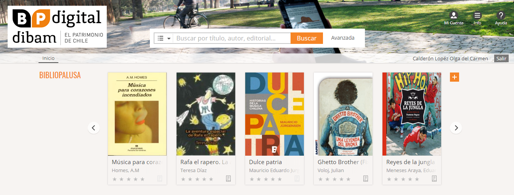
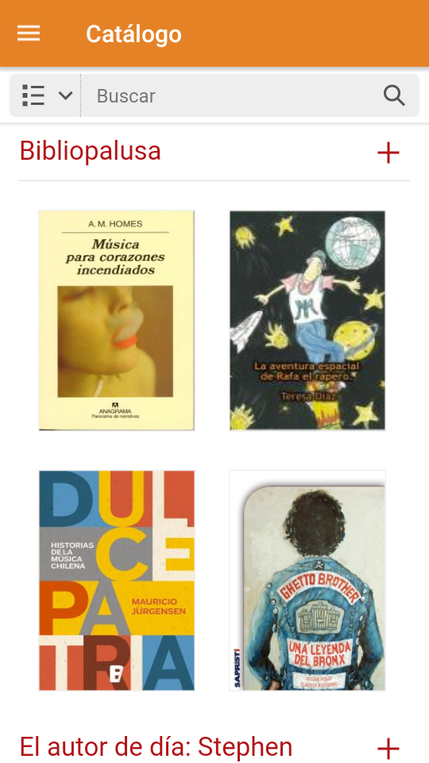
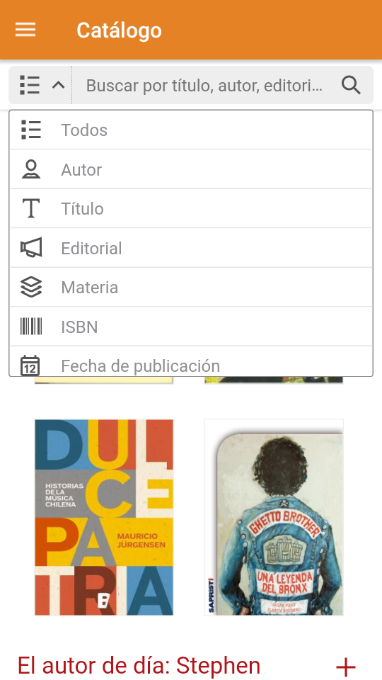
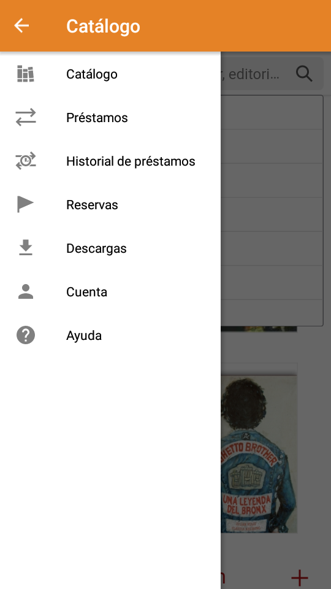
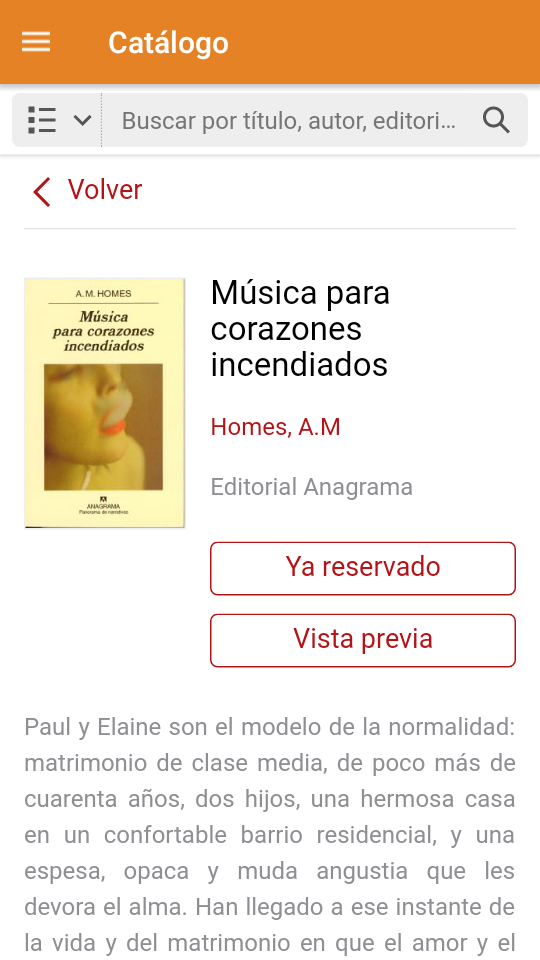

#Proyecto "Bp Digital"#

*Se nos planteo el desafío de crear o mejorar la experiencia ya existente de una aplicación o servicio, identificar principales problemáticas y optimizarlos.*

*Para esto planifiqué mis tiempos en dos semanas para el desarrollo del proyecto.*

*Primero me planteé el desafío de que tematica tomar y la más interesante fue cómo leen o porque no lo hacen las personas, de allí nació la hipótesis de que las aplicaciones existentes no tienen una suficiente atracción al público que no lee.Por lo tanto me enfoque en crear una nueva sección para personas con dificultades visuales.*

*Luego de eso, pude analizar la actual plataforma online, en el que llegue a la conclusión de que tiene problemas de conexión, falta de accesibilidad a la cuenta en caso de olvidar datos de la cuenta y también que no se pueden descargar a veces en los formatos más utilizados, además que para leerlos tiene que instalarse un programa previo.*

 
*Además también analice la aplicación móvil en la que llegue a la conclusión de que tiene problemas de continuidad, no se pueden revertir los cambios o acciones además de varios problemas de contraste, no se puede ajustar ningún tipo de personalización de la lectura. Además hay datos que no son guardados dentro de la aplicación. En resumen es un poco más legible en comparación con la plataforma web, pero a la vez los colores son un poco no adecuados considerando que debería ser más inclusiva con las personas que poseen diferentes capacidades visuales.*

*Aquí se puede acceder al documento en google drive*

https://docs.google.com/document/d/16Yyr6EHJ41VWK9IHLxPDF_fgMMiKg3CSIKxiGsseTf8/edit?usp=sharing

*Mi prototipo con interacción, esta diseñado en versión móvil:* https://marvelapp.com/14c0j646/screen/39652271

*También se puede acceder al proyecto en su totalidad en:*
https://drive.google.com/open?id=1bhyYsAN9CKETedvdmAA-6rGLgfnp3b9k